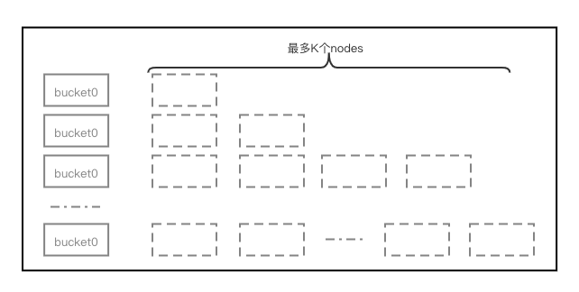
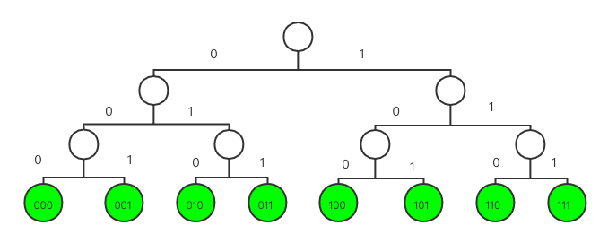
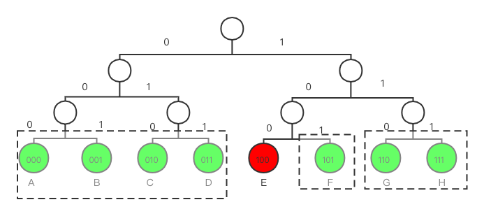
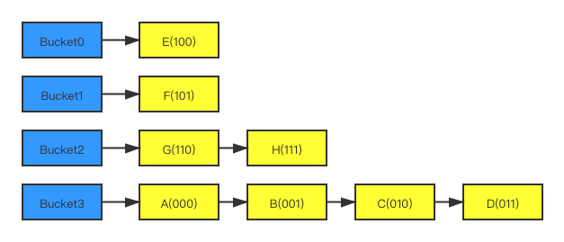
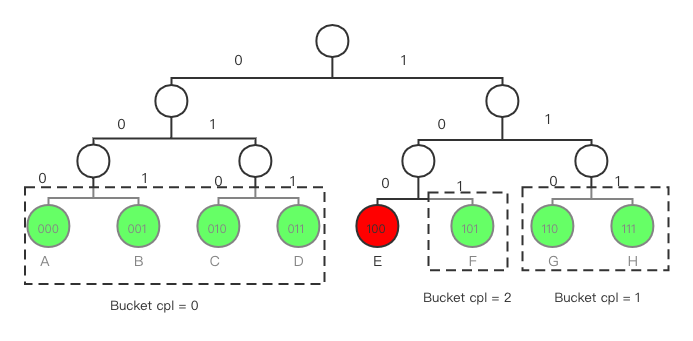
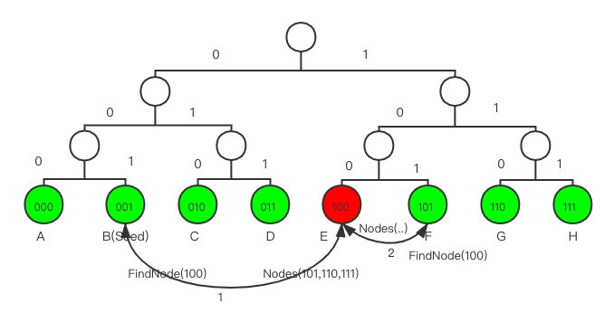

# Kademlia协议研究报告

## Kademlia协议介绍
Kademlia是一种通过分散式杂凑表实现的协议算法,Kademlia网络节点之间使用UDP进行通讯。这些节点通过一组数字（或称为节点ID）来进行身份标识。节点ID不仅可以用来做身份标识，还可以用来进行值定位。

## 基础概念

* Node ID 在P2P网络中，节点是通过唯一的ID来进行标识的，在原始的KAD算法中，使用160-bit哈希空间作为Node ID
* Node Distance 节点之家的距离，每个节点保存着自己附近节点的信息，但是在KAD算法中，距离并不是指物理距离，而是指一种逻辑距离，通过节点Node ID的按位异或运算得到
* XOR异或运算，是一种位运算，用来计算两个节点之间的距离。两个节点的Node ID按位进行XOR运算，结果越小，表示距离越近
* K-Bucket 用一个Bucket来保存与当前节点距离在某个范围内的所有节点列表。比如 bucket0, bucket1, bucket2 ... bucketN 分别记录[1, 2), [2, 4), [4, 8), ... [2^i, 2^(i+1)) 范围内的节点列表
* Bucket分裂 如果初始Bucket数量不够，则需要分裂（具体和实现有关）
* Routing Table记录所有buckets，每个 bucket 限制最多保存 K 个节点，如下图所示

* Update 在节点 bootstrap 过程中，需要把连接上的 peer 节点更新到自己的 Routing table 中对应的 bucket 中
* LookUp 查找目标节点，找到与目标节点最近（nearest/closest）的 bucket，如果已在 bucket 中，则直接返回，否则向该 bucket 中的节点发送查询请求，这些节点继续迭代查找
* 收敛 & 时间复杂度 查找会最终收敛至目标节点，整个查询过程复杂度是 Log N


## 构建网络拓扑
Kad网络中的每个节点都会被分配唯一的节点ID，一般是160bit的二进制数。节点之间可以计算距离，节点距离以节点ID的XOR值度量:
```
Dis(M,N) = XOR(M,N)
```
因此，节点之间的距离越近，意味着节点ID的公共前缀越长。节点之间的距离以节点的最长公共前缀(cpl)为度量，cpl越大，表示两个节点越接近，例如节点`A = 000100, B=000011, Dis(A,B) = cpl(A,B) = 3` ​。基于此，一个完整的网络空间可以被表示成为一颗如下图所示的二叉树，树的叶子节点代表网络节点，下图演示了使用3bit作为节点ID位数的节点树结构


从上图中每个节点的视角来看，它可以根据公共前缀长度将这颗二叉树分解为一系列不包含自己的子树。在上图的例子中，我们可以按照最长公共前缀的长度为0，1，2来划分子树。下图展示了从节点E(100)视角来分割上面网络树结果


节点<A,B,C,D>与E的公共前缀长度为0，将其归为一个单元，节点<G,H>与E的公共前缀长度为1将其归为单元2，节点<F>与E的公共前缀长度为2，将其归为单元3。由前面的定义知道。通过与E的距离，可以将网路中的节点分成一下4组Bucket：
```
Dis = 0: {E}
Dis = 1: {F}
Dis = 2-3: {G,H}
Dis = 4-7: {A,B,C,D}
```
## 构建路由表
构建路由表的本质是建立到网络全局的地图，目标是：对于节点​ `E` ，给定任意节点 `X` ​，可以根据节点​很容易计算出​距离 `X` 更近的节点列表。虽然我们的目标是一步到位的查找，但这是不现实的，这需要维护数量巨大的全局节点信息。我们退而求其次，采用迭代查找的思路：每次查找距离目标更近一点点。
### 基本
假如当前节点为E,X距离E上维护的节点Y的距离为
```
Dis(X,Y) = Dis(X,E) XOR Dis(E,Y)
```
其中，`Dis(A,B) = A XOR B`
所以，当节点E收到查询距离X更近的节点请求时，E先计算自身距离X的距离Dis(E,X) = d1，然后从自己维护的节点列表中选择出距离为E为d1的所有节点。
在前面的网络拓扑中我们知道，Kademlia协议中，每个节点按照与自己的距离来切割节点网络树：被切割的子树称之为 `Bucket` ​。整个路由表本质上便是一个 `Bucket` ​数组，Kademlia协议以​聚类网络节点：每个 `Bucket` ​中的节点必然与本节点具有相同的最长公共前缀。
由于节点只有160bit，最长公共前缀长度最大只有160，因此，路由表中的​ `Bucket` 数量最多也就160。但是每个​ `Bucket` 内节点数量可能会非常多，根据之前的计算，与节点最长公共前缀长度为0的​节点数占据网络总节点数量的1/2，​与节点最长公共前缀长度为1节点数占网络总节点数的1/4...
Kademlia协议对每个​ `Bucket` 内维护的节点数设置了一个上限，称之为​ `K` 值，在一般的实现中 `K=20` ​。一旦​ `Bucket` 内节点数超过​，便根据一定的淘汰算法进行更新。
根据该基本原理，节点构建的路由表如下图所示：


## Bucket分裂
在一些实现Kademlia协议实现中，每个节点初始时只有一个 Bucket ​，感知到网络上有节点时，直接将远程节点信息添加至该`Bucket`​，直到该`Bucket`​内节点数量超过`K`​，此时开始分裂`Bucket` 。
所谓的分裂是指创建一个新的 `Bucket` ​，然后将原来​ `Bucket` 内的部分节点迁移至新 `Bucket` ​。因为原`Bucket`​内的节点与本节点的距离不尽相同，所以，迁移的原则是：将与本地节点更近(即​更大公共前缀)节点迁移至新建 `Bucket` ​，迁移完成后再判断新建 `Bucket` ​内节点数是否超过​限制，如果是，继续对该新建 `Bucket` ​进行分裂。
上面提到迁移的过程中会将部分节点迁移至新 `Bucket` ​，那么如何选择这些需要被迁移的节点呢？答案是根据​节点与本节点之间的cpl决定：

> 需要分裂的​都是与本节点最近的节点，插入逻辑决定了该​节点与本节点之间的距离不尽相同，但均有一个特点：​cpl >= len(Buckets) 。

初始状态时，本地只有1个​，此时分裂的目标是：
```
newBucket := bucket.Split(len(rt.Buckets)-1, rt.local)
```

第一个参数的cpl ，即将 `Bucket` ​中与​ `rt.local` 的​ `cpl` 超过​ `len(rt.Buckets)-1` 的节点都迁移至新的 `Bucket` 。​ cpl 为0即距离当前节点最远的那部分节点（没有任何公共前缀)。
一次分裂后，第一个 `Bucket` ​中保留的全部是与当前节点无任何公共前缀的节点，第二个 `Bucket` ​中保留的全部是与当前节点公共前缀大于等于1的节点。
接下来判断第二个​ `Bucket` 是否需要再次分裂，如果分裂，再次创建新 `Bucket` ​，然后将第二个​ `Bucket` 中与本地节点公共前缀超过1的节点迁移至新 `Bucket` ，与本地节点公共前缀长度为1的节点依然保留在第二个​ `Bucket` 中。
下面演示分裂过程，假设演示中 `Bucket` ​内的节点数最大 `K` 为1，而不是20。假设本地节点为​ `E(100)` ，初始时所有其他节点都位于一个 `Bucket` ​内，共包含7个节点。
1. 第一次分裂
创建一个新的`Bucket`​，将原​`Bucket`中与`local`的`cpl`超过0的节点迁移至新的`Bucket` ​。于是，此时两个 `Bucket` ​内的内容变为：
```
Bucket_old = {A,B,C,D}
Bucket_new = {E,F,G}
```
接下来​再次分裂，将其中与`local`的`cpl`超过1的节点迁移至新的 `Bucket` ​，于是，​现在就变为：
```
Bucket_old = {F,G}
Bucket_new = {E}
```
形成了如下的分区：



## 路由算法

路由算法要解决的是如何根据目标ID找到与该ID最近的节点地址。在一个对等网络中，某个节点要查询其他节点的信息时，它可依赖的信息只有两个：
* 目标节点ID
* 当前节点维护的路由表
其查询的核心思想是：逐步迭代，递近查找。其基本过程如下：
1. 发起者首先计算自身(​L)与目标节点(​T)的距离，即​ cpl ，查询本地维护的路由表，计算方法是​`Bucket = locl.Buckets[cpl]`，这个 [公式] ​中的节点与目标节点有着公共前缀。然后再从该 `Bucket` ​中选择与目标节点有最长​ `cpl` 的节点​，接下来本地节点向​发起查询请求(​`QueryNode`)，因为​距离`T`更近，相当于第一次缩短了与目标节点​`T`的距离；
2. `X`收到 `L` ​发起的对目标节点 `T` ​的定位消息(Message_FIND_NODE)时，会根据自身维护的路由表信息，返回距离​ `T` 更近的节点供查询发起者继续查询。当然，如果目标节点就是​自身，那直接返回自身信息即可。需要说明的是：​给​返回的响应并非是距离目标节点最近的那一个节点，而是一批节点（即协议中定义的​值`K`）。这样做有几点好处：1). 避免单个节点不可用导致的查询失败；2). 查询发起者可以根据响应结果进行并发查询，提升查询速度。
3. 查询发起者`L`收到响应后，会将被这些作为接下来的查询对象继续进行查询。查询收到响应时，会对响应中的结果进行过滤：如果该节点在之前已经被询问过，便不再加入待查询列表，保证查询的收敛性。
查询的最终结果是得到了一批距离目标节点很近的节点列表，然后从节点列表中选择出最接近目标的​个节点。选择这​个节点的目的是可用来读，也可用来写对象，具体见后面描述。

## 路由表更新

Kademlia网络中节点是动态变化的，节点可新接入网络，也可从网络离线。这也意味着每个节点的路由表也是一直变化着的。

### 新节点上线
新节点​`N`上线时，需要为其提供一个种子节点`S`​，​以`S`作为中介加入Kademlia网络，具体来说：
1. 将​`S`加入本地路由表，​成为`N`​的种子节点
2. 向`S`​发起一次节点查询请求(FIND_NODE)，查询的目的节点其实是​自身；该请求的目的有二：第一告诉`S`​新增了节点`N`​，第二​通过​`S`发现集群中更多的节点。而​发起了指向自身的查询请求也很有意思：其一是因为`S`此时还不知道系统更多的节点信息；其二是通过这种方式​`N`可以快速地找到更多距离自己更接近的节点。
3. `S`收到`N`​的查询目标节点​请求，首先将​节点 `N`加入自身的路由表中，然后给`N`最多返回`K`个距离`N`​更接近的节点信息；
4. `N`收到​`S`的响应，将响应中的节点加入自身路由表，然后对这些节点分别发起查询请求，当然，查询的目标还是​自身。
大致流程如下图所示


### 节点离线
节点离线在Kademlia协议中无需做特殊处理，如果某个节点离线，那么其离线事件最终会反馈到网络节点的路由表中，将其从路由表中剔除即可，相比于Chord协议有了极大的简化。
