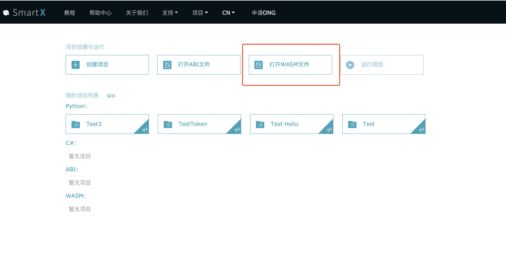

# wasm使用教程

SmartX已经支持WASM合约的部署和调用。现在开始体验吧。

## 1.部署

首先，我们需要登录SmartX。登录成功后，我们会进入“项目列表“页面。在这里，我们点击“打开WASM文件”按钮。

我们需要输入wasm智能合约的名称，并选择一个wasm合约的字节码文件。点击“确定”按钮。这会帮我们生成一个wasm合约的项目，方便以后管理。

打开新创建的wasm合约项目，我们看到，合约编辑区域显示的是wasm合约的字节码；我们可以替换这部分字节码内容。

接下来，我们可以部署该wasm合约，该步骤与部署Neo VM合约没有差异。

在右侧“部署”工具页内填好相关信息，点击“部署”按钮，SmartX会唤起Chrome插件钱包Cyano wallet（需要提前安装好最新版）,要求用户输入钱包密码，如果Cyano钱包里有足够的ONG，稍等片刻，wasm合约就会部署到Ontology的网络上。

部署成功后，我们会进入合约的“运行”页面。在这里，我们可以调用wasm合约的方法。

我们需要输入要调用的方法名称，添加方法所需的参数，给参数选好正确的类型并输入参数值。然后选择点击“预执行”或者“运行”按钮。合约执行的结果会显示在左侧下方的日志区。

至此，我们完成了在SmartX上对wasm合约的部署和调用。